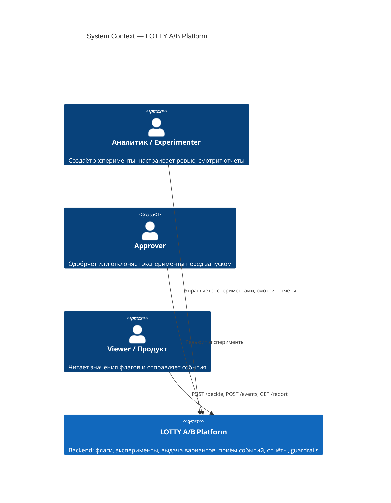
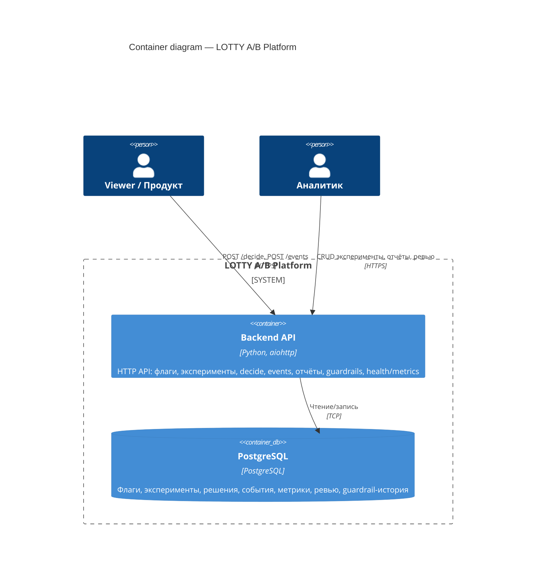
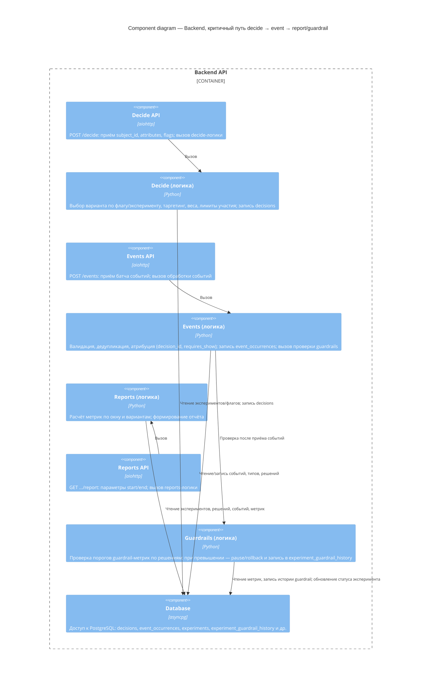

# C4-диаграммы LOTTY A/B Platform (B7-5, B7-6, B7-7)

Три уровня C4: контекст системы, контейнеры, компоненты по критичному пути decide → event → report/guardrail.

---

## B7-5. C4 Context (уровень 1)

Внешние акторы и граница системы «LOTTY A/B Platform».

**Граница платформы:** один backend-сервис + БД; клиенты (продукт, аналитики, аппруверы) взаимодействуют через HTTP API.

---

## B7-6. C4 Container (уровень 2)

Основные контейнеры (сервисы/хранилища) и их ответственности.

**Ключевые взаимодействия:** продукт → Backend (decide, events); аналитик → Backend (эксперименты, отчёты); Backend → БД (все данные).

---

## B7-7. C4 Component — критичный путь decide → event → report/guardrail

Детализация **одного** контейнера (Backend) по критичному потоку. Без детализации до классов.

**Поток:** Decide API → логика решений → БД; Events API → валидация/дедупликация/атрибуция → БД → (опционально) Guardrails → отчёт строится из тех же данных через Reports API → Reports logic → БД.

---

Матрица соответствия: `backend/docs/compliance-matrix.md`.  
Карта репозитория и ограничения: `backend/README.md`.
