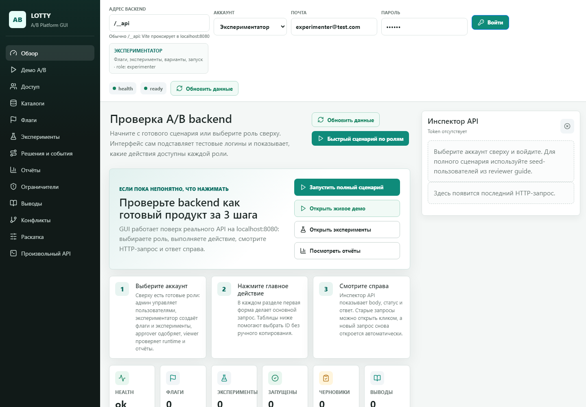
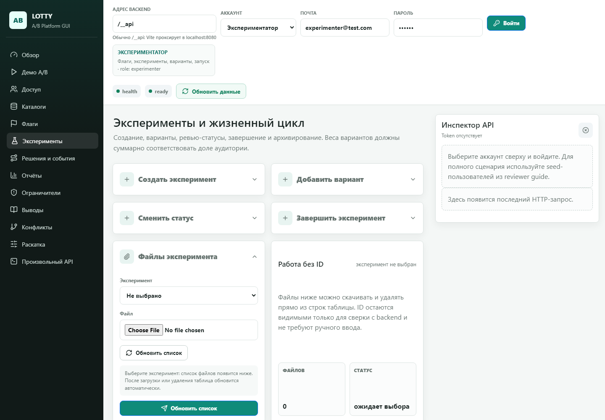
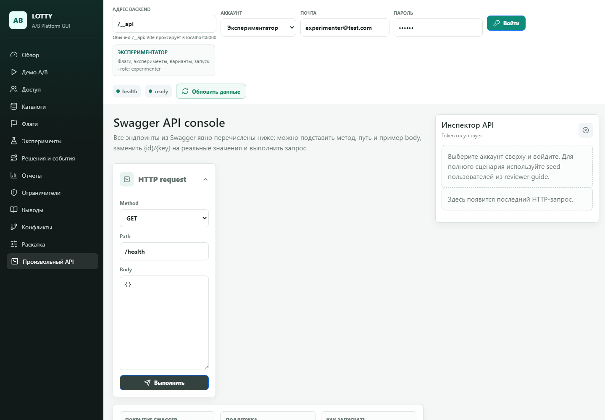

# Пояснительная записка

## Название проекта

**LOTTY A/B Platform** — backend-сервис и web-интерфейс для управления A/B-экспериментами, feature flags, событиями, метриками и отчётами.

## Авторы проекта

Авторская разработка: **Vubni**.  
GitHub автора указан в основном README проекта: <https://github.com/Vubni>.

## Описание идеи

Проект решает задачу полного цикла A/B-тестирования: команда создаёт feature flag, заводит эксперимент с вариантами, отправляет его на ревью, запускает на часть аудитории, получает решения для пользователей через runtime API, собирает события и анализирует результат в отчётах. Идея проекта — сделать не просто CRUD-приложение, а небольшую продуктовую платформу, где есть роли, согласование, guardrail-ограничения, история решений, learnings после завершения эксперимента и удобный GUI для демонстрации всех сценариев.

## Описание реализации

Backend реализован как монолитный сервис на `aiohttp`. Точка входа находится в `backend/server.py`: там создаётся приложение, подключаются CORS, Swagger/OpenAPI-документация, middleware метрик и все REST-маршруты с префиксом `/api/v1`. Код разделён по слоям: `api/` содержит HTTP-обработчики, `functions/` — доменную логику, `database/` — работу с PostgreSQL, `models.py` — SQLAlchemy ORM-модели, а `templates/` — HTML-шаблоны отчётов.

Основные сущности проекта: `User`, `FeatureFlag`, `Experiment`, `ExperimentVariant`, `ExperimentAttachment`, а также SQL-таблицы для событий, решений, метрик, guardrails, конфликтных доменов и learnings. Для авторизации используется JWT: пользователь регистрируется или входит через `/api/v1/register` и `/api/v1/auth`, после чего GUI отправляет `Authorization: Bearer <token>`. Для файлов реализованы upload, list, download и delete attachments к экспериментам; файл сохраняется на диск, а метаданные попадают в PostgreSQL.

Интересная часть реализации — поток `decide -> events -> report`: runtime API выдаёт вариант эксперимента субъекту, событие привязывается к `decision_id`, а отчёты затем считают результаты по вариантам и метрикам. Дополнительно добавлены guardrails, конфликтные домены и autopilot ramp-up, чтобы показать более реалистичную логику запуска экспериментов. GUI лежит в `frontend/a-b-gui-app`, сделан на React + Vite и покрывает основные сценарии проверяющего: вход под ролями, CRUD-флаги, эксперименты, события, отчёты, загрузку файлов и произвольный вызов API.

## Технологии и библиотеки

Для запуска backend нужны Python-зависимости из `backend/requirements.txt`. Ключевые библиотеки: `aiohttp`, `aiohttp-apispec`, `aiohttp-cors`, `asyncpg`, `SQLAlchemy`, `pydantic`, `PyJWT`, `Jinja2`, `aiokafka`, `python-dotenv`.

Для интерфейса нужны Node.js-зависимости из `frontend/a-b-gui-app/package.json`: `react`, `react-dom`, `vite`, `typescript`, `bootstrap`, `lucide-react`.

Хранение данных выполнено в PostgreSQL. Схемы лежат в `docker/postgres/schema/*.sql`, а воспроизводимый запуск окружения описан в `docker-compose.yml`: PostgreSQL, Kafka/Zookeeper, backend и тестовый профиль. Для CI добавлен `.gitlab-ci.yml`. Отдельного Replit/Tuna-хостинга в репозитории нет: вместо этого выбран Docker Compose как более предсказуемый способ локального и демонстрационного запуска.

Быстрый запуск backend:

```bash
docker compose up -d
```

Быстрый запуск GUI:

```bash
cd frontend/a-b-gui-app
npm install
npm run dev -- --host 127.0.0.1
```

## Особенности, сложности и изменения относительно базового ТЗ

В проект добавлено больше, чем минимальный набор требований: роли пользователей, approver-группы, Swagger UI, Prometheus-like метрики, Kafka-режим для событий, HTML-отчёт через Jinja2, загрузка файлов эксперимента, learnings и автопилот раскатки. Это делает проект ближе к реальной платформе экспериментов, а не только к учебному CRUD.

Основная сложность была в связке бизнес-потока: решение по флагу должно быть воспроизводимым, событие должно корректно привязываться к выданному решению, а отчёт должен строиться по тем же данным. Из-за этого часть логики вынесена в отдельные функции и SQL-схемы, а для проверки добавлены demo-пользователи, seed-данные и GUI-сценарий по ролям.

От упрощённого хранения в `txt`/`csv` отказались в пользу PostgreSQL, потому что проекту нужны связи между пользователями, экспериментами, вариантами, событиями и отчётами. От отдельного внешнего хостинга также отказались: текущая версия ориентирована на запуск через Docker Compose и локальную демонстрацию.

## Скриншоты интерфейса

### Обзор и состояние системы



### Эксперименты и работа с файлами



### Каталог API и инспектор запросов


